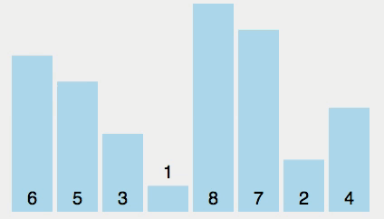
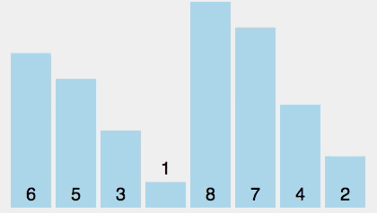
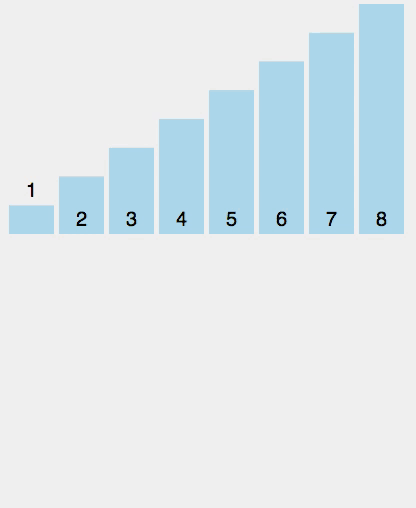

# Sorting Algorithms - part 1

## Objectives

* Implement a bubble sort algorithm in JavaScript
* Implement a selection sort algorithm in JavaScript
* Implement an insertion sort algorithm in JavaScript

## Introduction

When you're dealing with data, sorting is a very common task. While [sorting algorithms](https://en.wikipedia.org/wiki/Sorting_algorithm) are well-understood, they also make great fodder for interview questions, so it's essential that you understand, implement, and talk about some simple sorting algorithms.

Below you will see three common sorting algorithms (bubble sort, selection sort, and insertion sort) and some links to see them in action. One of the best ways to learn these algorithms is to try to implement them yourself. Use sticky notes, pen and paper, cups, colored blocks, or whatever you find best and try to recreate these sorting scenarios. Not only will this help you tremendously in your understanding of the algorithm, but it is __essential__ to have a fundamental knowledge before trying to implement them.

## Sorting Algorithms

### Bubble Sort

Here's how [bubble sort](https://en.wikipedia.org/wiki/Bubble_sort) works...

**Pseudo code**

1. For each element in the list, look at the element to the right.
2. If the value on the left is greater than the value on the right, swap the two values.
3. Keep swapping until you're at the end of the array. Then move onto the next element in the array and repeat.

Bubble sort can be implemented using nested loops or recursion.

We know for sure that after 1 pass the rightmost element is sorted correctly, after 2 passes the right 2 elements are sorted correctly, and so on.

How can we make bubble sort even smarter?

We can always count to see the number of swaps and if there are none we know it's sorted.

> Note: for this algorithm (and for later ones), it may be helpful to implement a simple helper function called `swap` which takes in an array and two indices, and swaps the values in the array at those two indices.

#### Complexity

Bubble sort is NOT an efficient algorithm. Its worst case performance is O(n2) ([quadratic time](https://en.wikipedia.org/wiki/Time_complexity)), because you have to make n iterations through a list checking all n elements each pass. This runtime means that as the number of elements sorted increase, the runtime increases quadratically. But if efficiency isn't a major concern or if you are sorting a small number of elements, bubble sort is a great way to start thinking about sorting.

### Selection Sort

[Selection sort](https://en.wikipedia.org/wiki/Selection_sort) is very similar to bubble sort. The difference is that instead of comparing each array item to its neighbor, the goal is to locate the *smallest* remaining value and drop it into the correct place in the array. The basic algorithm looks like this:

**Pseudo code**

1. Assume the first item is the smallest value (minimum).
1. Compare this item to the second item.
1. If the second item is smaller than the first, set the second item as the new minimum.
1. Continue until you reach the end of the array.
1. If the minimum value (index) is not the value (index) you started with, swap the two.

> #### Practice with [this interactive card game](https://www.khanacademy.org/computing/computer-science/algorithms/sorting-algorithms/a/sorting)

#### Complexity

Since selection sort is so similar to bubble sort, you can probably guess what the complexity of this sorting algorithm is. Once you've gotten your tests to pass in the exercise below, try to analyze your code to determine the complexity a little more rigorously.

### Insertion Sort

[Insertion sort](https://en.wikipedia.org/wiki/Insertion_sort) works by taking your array and incrementally sorting the values on the left hand side.

**Pseudo code**

1. For each element in the list, look at the element to the left.
2. If the elements value is less than the value on the left, swap the two values.
3. Keep swapping the element until you're at the beginning of the array.
3. Else, move on to the next element.

Note that after step 1, the first two elements will be sorted. After step 2, the first three elements will be sorted. After repeating step 2 once, the first four elements will be sorted, and so on. After each step in the process, the sorted portion of the area increases in size by 1, until the entire array is sorted.

#### Complexity

If the array is already sorted, insertion sort is relatively fast at [O(n)](https://en.wikipedia.org/wiki/Time_complexity#Linear_time). But in general, the complexity here is [O(n2)](https://en.wikipedia.org/wiki/Time_complexity). Can you convince yourself why this is the case after you've implemented insertion sort on your own?

## Picking a Sorting Algorithm

With all of the sorting algorithms to choose from – and we've only named a few – which one is **best**? Well, it depends. This largely depends on the type of data we're sorting, how large the input is, and how much performance and speed matter to us.

> If you'd like to dig into sorting algorithms even more, consider watching [15 Sorting Algorithms in 6 Minutes](https://www.youtube.com/watch?v=kPRA0W1kECg) to see how some of them compare visually.

### Bonus question

Most programming languages have a sorting mechanism built in. What sorting algorithm does your language of choice use?

# Exercises:

Once you're comfortable with the general idea of sorting algorithms, the best way to solidify your understanding is to write one out in code.

# Implementing Sorting Algorithms in Javascript

## Part 1: Bubble Sort, Selection Sort, Insertion Sort

Try to implement bubble sort, selection sort, and insertion sort (if you need a refresher on these algorithms, check out the [computer science curriculum](https://github.com/gSchool/computer-science-curriculum/blob/master/Unit-2/04-sorting-intro.md)).

For each of these algorithms, you'll also find it helpful to implement a `swap` function which swaps to values in an array.

Your goal is to get the tests for `bubbleSort`, `selectionSort`, `insertionSort`, and `swap` to pass. Note: The tests for the three searching algorithms are the same, but don't use the same implementation for each! The goal of this exercise is for you to be able to implement the different algorithms, even though they have the same effect on the arrays in the tests.

## Stretch Goal: Merge Sort, Quicksort

Try to implement two more advanced sorting algorithms: merge sort and quicksort.

For merge sort, you'll find it helpful to implement a `merge` function which takes two sorted arrays and merges them into one sorted array.

Your goal is to get the tests for `mergeSort`, `quickSort`, and `merge` to pass. Note: As in Part 1, don't use the same implementations for these searching algorithms!

### Helpful Resources

* [https://study.cs50.net](https://study.cs50.net)
* [http://www.sorting-algorithms.com/](http://www.sorting-algorithms.com/)
* [Bubble Sort in JavaScript](http://www.nczonline.net/blog/2009/05/26/computer-science-in-javascript-bubble-sort/)
* [Selection Sort in JavaScript](http://www.nczonline.net/blog/2009/09/08/computer-science-in-javascript-selection-sort/)
* [Insertion Sort in JavaScript](http://www.nczonline.net/blog/2012/09/17/computer-science-in-javascript-insertion-sort/)
* [Visual Sorting](http://visualgo.net/sorting)
