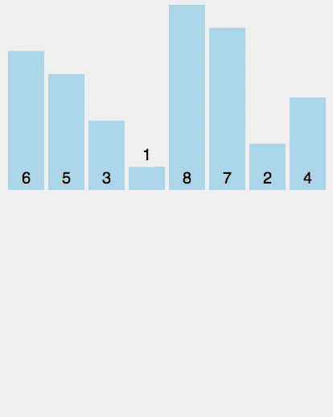

# Sorting Algorithms, Part 2

## Objectives

* Implement a merge sort algorithm in Javascript
* Implement a quicksort algorithm in Javascript

## Introduction

In [Part 1](../Unit-2/04-sorting-intro.md), you learned about three relatively straightforward sorting algorithms: bubble sort, selection sort, and insertion sort. Compared to other sorting algorithms, these three are some of the most approachable and easy to reason about. However, if you're trying to sort an array with millions of values, these algorithms are also not terribly efficient: on average, all three of them are O(n<sup>2</sup>), where n represents the size of the array being sorted.

In this section, we'll learn about two other sorting algorithms: merge sort and quicksort. These two algorithms perform better on average as the size of the array grows, but they're also a bit more complicated. Let's talk about these algorithms conceptually and create some pseudo-code; you'll be asked to implement each of these algorithms at the end.

## Merge Sort

Merge sort works by decomposing the array into smaller chunks, which are then sorted and merged together. This process goes all the way down to arrays of size 1, which are super easy to sort!

Here's a step-by-step description of merge sort:

**Pseudo Code:**

1. If your array has a length less than 2, congratulations! It's already sorted.
2. Otherwise, cut your array in half, and consider the two sub-arrays separately.
3. Sort each of your smaller subarrays using merge sort.
4. Merge your two subarrays together.



Through this recursive process, you'll wind up with a sorted array!

In order to implement this function, it's useful to have a helper function that takes two sorted arrays and merges them together to create a new, larger sorted array. Here's some pseudo-code to get you started:

```js
function merge(arr1, arr2) {

	// 1. declare a new empty array, and pointers corresponding to indices in arr1 and arr2 (set them both to 0)
	// 2. if the first element in arr1 is less than the first element in arr2, push the first element in arr1 to the new array, and move the pointer for arr1 one spot to the right. Otherwise, do this for arr2.
	// 3. Repeat this process until you've gone through one of the arrays
	// return the new array, concatenated with whatever elements are remaining from the array that you haven't exhausted yet.

}
```

Once you've implemented this merge function, you can implement merge sort using the pseudo code outlined above.

**Time Complexity**

Determining the time complexity of merge sort requires some careful though. From a high level, merge sort works by subdividing the original array into subarrays that are half as long, until the subarrays can't be divided any further and are therefore already sorted. 

Then comes the merging. At each level (1-element arrays to 2-element arrays, 2-element arrays to 4-element arrays, and so on), there are O(n) operations that need to be performed. And how many levels are there? Well, the number of levels equals the number of times you can divide n by 2 before you get a quotient that's less than or equal to 1. But this is just log<sub>2</sub>(n). Therefore, the time complexity is log(n) copies of O(n), a.k.a. O(n log(n))!


Vieiwing the image above as a tree, its height is roughly equal to log<sub>2</sub>(n).

(For some more discussion on this, check out this [programmers stackexchange](http://programmers.stackexchange.com/questions/297160/why-is-mergesort-olog-n) The above image comes from that conversation).

**Space Complexity**

Because merge sort requires the use of a merge function which takes two arrays and creates a new array that's (roughly) twice as large, the space complexity of merge sort is O(n).

## Quick Sort

Watch [Alex explain quick sort](https://www.youtube.com/watch?v=XE4VP_8Y0BU&feature=iv&src_vid=M5c_RFKVkko&annotation_id=annotation_155416) on Computerphile.

> Quicksort is a divide and conquer algorithm in the style of merge sort. The basic idea is to find a “pivot” item in the array to compare all other items against, then shift items such that all of the items before the pivot are less than the pivot value and all the items after the pivot are greater than the pivot value. After that, recursively perform the same operation on the items before and after the pivot.

There are two basic operations in the algorithm, swapping items in place and partitioning a section of the array. The basic steps to **partition** an array are:

**Pseudo code:**

1. Find a “pivot” item in the array. This item is the basis for comparison for a single round.
1. Start a pointer (the left pointer) at the first item in the array.
1. Start a pointer (the right pointer) at the last item in the array.
1. While the value at the left pointer in the array is less than the pivot value, move the left pointer to the right (add 1). Continue until the value at the left pointer is greater than or equal to the pivot value.
1. While the value at the right pointer in the array is greater than the pivot value, move the right pointer to the left (subtract 1). Continue until the value at the right pointer is less than or equal to the pivot value.
1. If the left pointer is less than or equal to the right pointer, then swap the values at these locations in the array.
1. Move the left pointer to the right by one and the right pointer to the left by one.
1. If the left pointer and right pointer don’t meet, go to step 1.

The **swap** function is very easy to implement:

```js
function swap(arr, a, b) {
    var temp = arr[a];
    arr[a] = arr[b];
    arr[b] = temp;
}
```

Here is one way to **partition** the array:

```js
function partition(items, left, right) {
    // find and assign pivot by halving sum of right and left index
    var pivot = items[Math.floor((right + left) / 2)],
        i     = left,
        j     = right;
    // loop until the pointers pass one another
    while (i <= j) {
        // increment i while item[i] is less than pivot
        while (items[i] < pivot) {
            i++;
        }
        // decrement j while item[j] is more than pivot
        while (items[j] > pivot) {
            j--;
        }
        // swap i and j when i is less than or equal to j
        // increment and decrement i and j, respectively
        if (i <= j) {
            swap(items, i, j);
            i++;
            j--;
        }
    }
    // return i to be used as index for left or right pointers in recursive calls of quicksort
    return i;
}
```

And finally, here's the implementation for quick sort, which uses both the partition and swap functions:

```js
function quickSort(items, left, right) {
    // declare index to be used later when each partition returns 'i'
    var index;
    // if statement to handle the base case (any array smaller
    // than length of 1 is returned
    if (items.length > 1) {
        // if no left or right is entered, set them to first and last indeces in array
        left = typeof left !== "number" ? 0 : left;
        right = typeof right !== "number" ? items.length - 1 : right;
        // set index to return value of partition function
        index = partition(items, left, right);
        // compare current left value to index - 1
        // if left is smaller, then there are still items to be sorted on
        // the left side of the array, so quicksort is called recursively
        if (left < index - 1) {
            quickSort(items, left, index - 1);
        }
        // compare current right value to index
        // if index is smaller than right, then there are still items
        // to be sorted on the right side of the array, so quicksort
        // is called recursively
        if (index < right) {
            quickSort(items, index, right);
        }

    }
    // all recursive calls have finished so the sorted array is returned
    return items;
}
```

## Picking a Sorting Algorithm

With all of the sorting algorithms to choose from – and we've only named a few – which one is **best**? Well, it depends. This largely depends on the type of data we're sorting, how large the input is, and how much performance and speed matter to us.

You don't have a way to measure these sorting algorithms until the Big-O Notation lesson in this unit. Until then, consider watching [15 Sorting Algorithms in 6 Minutes](https://www.youtube.com/watch?v=kPRA0W1kECg) to see how some of them compare visually.

### Bonus question

Most programming languages have a sorting mechanism built in. What sorting algorithm does your language of choice use?

# Exercises:

Once you're comfortable with the general idea of sorting algorithms, the best way to solidify your understanding is to write one out in code. Pick from one of these (or do both!) to practice writing sorting algorithms.

- [Implement merge sort](https://github.com/gSchool/js_merge_sort)
- Implement quick sort 

## Resources: 

* [Merge Sort in JavaScript](http://www.nczonline.net/blog/2012/10/02/computer-science-and-javascript-merge-sort/)
* [Merge Sort Wikipedia](https://en.wikipedia.org/wiki/Merge_sort)
* [Quick Sort in JavaScript](http://www.nczonline.net/blog/2012/11/27/computer-science-in-javascript-quicksort/)
